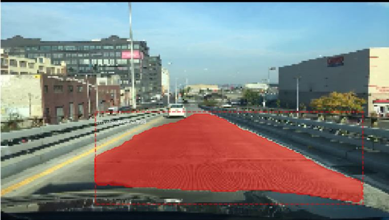

# drivable-area-segmentation
This project implements driving area segmentation by applying on transfer learning on [Mask R-CNN](https://arxiv.org/abs/1703.06870) model [here](https://github.com/matterport/Mask_RCNN). We have used [Berkeley Driving Dataset](http://bdd-data.berkeley.edu/), for rest of the project acronym BDD has been used. 

The repository includes:
* Jupyter notebook to visualize the training data and masks
* Jupyter notebook to visualize the detection pipeline at every step
* Jupyter notebook to ensure label information is present for each training and validation file
* Training code for BDD 
# Getting started 
In order to run transfer learning on [Mask R-CNN](https://arxiv.org/abs/1703.06870) 
## Clone matterport Mask-RCNN repo
```bash
git clone https://github.com/matterport/Mask_RCNN
```
## Clone this repository 
```bash
cd /Mask_RCNN/samples/
mkdir bdd
git clone https://github.com/beeRitu/drivable-area-segmentation
```
Ensure all the jupyter notebooks are in the folder 
```bash
/Mask_RCNN/samples/bdd
```
## Download the dataset
Dataset can be downloaded from [Berkeley Driving Dataset](http://bdd-data.berkeley.edu/). There are 70k training images, 10k validation images and 20k test images. 
